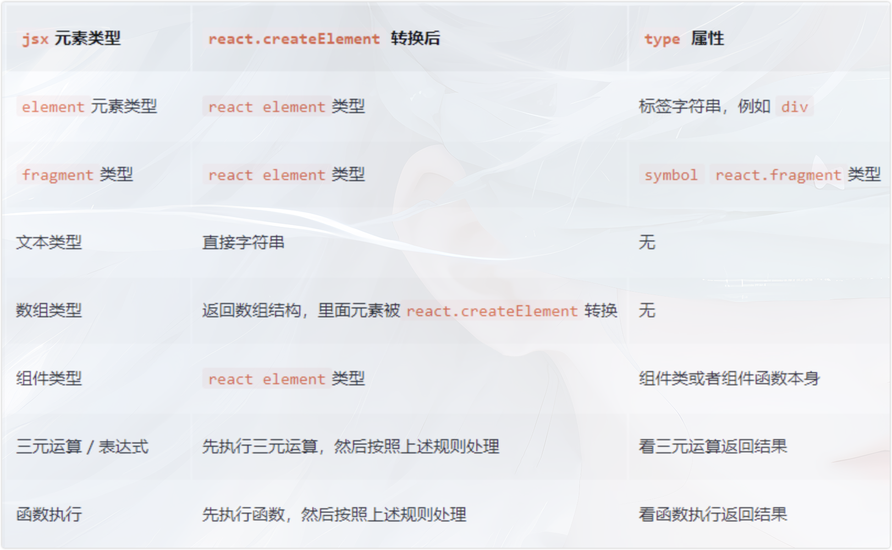

# JSX

## 什么是jsx

是一种JS和HTML混合的语法，将组建的结构、数据、样式聚合在一起

## 什么是元素

JSX是一种语法糖，会被babel转义成React.createElement语法，返回一个react元素
react元素是一个普通的js对象，用来描述你在屏幕上看到的内容
ReactDOM来确保浏览器中的真实DOM数据和react元素保持一致

step1：JSX（打包使用babel转义）

```
<h1 className="title" style={{color: 'blue'}}> hello </h1>
```

step2：babel转义后的代码（在浏览器执行，返回虚拟DOM）

```
React.createElement('h1', {
  className: 'title',
  style: {
    color: 'blue'
  }
}, 'hello')
```

step3：结果(虚拟DOM)

```
{
  props: {
    type: 'h1',
    className: 'title',
    style: {
      color: 'red'
    },
    children: 'hello'
  },
}

```

<!-- cross-env DISABLE_NEW_JSX_TRANSFORM=TRUE 禁用jsx新转换器 -->

## jsx 的转换规则



## jsx 用法

1、渲染两个相邻的元素，需要外面包裹一个标签<></>
2、行内样式的写法，jsx为了区分是html还是js，需要用{}来区分
3、{} 表示的是写js，可以是三元表达式、取值、（只要内容有返回值就可以）
4、属性名字变化 htmlFor => for、className => class
5、dangerouslySetInnerHTML={\_\_html: str}把内容当成html插入到页面中
6、注释只能写js注释
7、列表循环 map

## 不同种类的 fiber Tag

React 针对不同 React element 对象会产生不同 tag (种类) 的fiber 对象。首先，来看一下 tag 与 element 的对应关系：

```javascript
export const FunctionComponent = 0; // 函数组件
export const ClassComponent = 1; // 类组件
export const IndeterminateComponent = 2; // 初始化的时候不知道是函数组件还是类组件
export const HostRoot = 3; // Root Fiber 可以理解为根元素 ， 通过reactDom.render()产生的根元素
export const HostPortal = 4; // 对应  ReactDOM.createPortal 产生的 Portal
export const HostComponent = 5; // dom 元素 比如 <div>
export const HostText = 6; // 文本节点
export const Fragment = 7; // 对应 <React.Fragment>
export const Mode = 8; // 对应 <React.StrictMode>
export const ContextConsumer = 9; // 对应 <Context.Consumer>
export const ContextProvider = 10; // 对应 <Context.Provider>
export const ForwardRef = 11; // 对应 React.ForwardRef
export const Profiler = 12; // 对应 <Profiler/ >
export const SuspenseComponent = 13; // 对应 <Suspense>
export const MemoComponent = 14; // 对应 React.memo 返回的组件
```

### fiber 对应关系

child： 一个由父级 fiber 指向子级 fiber 的指针。
return：一个子级 fiber 指向父级 fiber 的指针。
sibling: 一个 fiber 指向下一个兄弟 fiber 的指针。

> 对于上述在 jsx 中写的 map 数组结构的子节点，外层会被加上 fragment ；
> map 返回数组结构，作为 fragment 的子节点。
