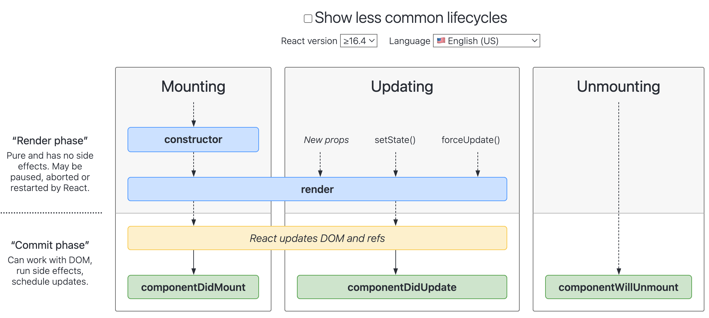

### 类组件的生命周期

地址链接：https://projects.wojtekmaj.pl/react-lifecycle-methods-diagram/

#### construct

#### render

#### componentDidMount

只会执行一次
可以使用state
页面挂载完成
通常会将网络请求、启动计时器、添加一些订阅的操作等操作

#### componentDidUpdate

#### componentWllUnmount

组件卸载前调用，通常在这里销毁一些事件的监听、计时器等操作
